# 系统名称 
仓库管理系统 warehouse 

## 基本说明

超级用户账号：admin

默认登陆密码（所有用户的初始密码）：666666

锁屏密码（为实现与后端登陆密码对比，为静态数据）：666666

未实现首页左端的搜索功能

上传头像时，使用相对路径创建会使文件夹无法创建，导致图片无法显示；默认头像路径被动态路径覆盖，有冲突，无法显示默认头像

使用图片时，先选择本地的就对路径，再重新上传src/main/resources/static/resources/images中的图片，才可显示图片

## 系统概要
仓库管理系统总共分为两个大的模块，分别是系统模块和业务模块。其中系统模块和业务模块底下又有其子模块。
## 功能模块
### 一、业务模块
#### 1、客户管理
1. 客户列表
2. 客户分页和模糊查询
3. 客户添加、修改、删除、批量删除

#### 2、供应商管理
1. 供应商列表
2. 供应商分页和模糊查询
3. 供应商添加、修改、删除、批量删除

#### 3、商品管理
1. 商品列表
2. 商品分页和模糊查询
3. 商品添加、修改、删除、商品图片的上传

#### 4、商品进货管理
1. 商品进货列表
2. 商品进货分页和模糊查询
3. 商品进货添加、修改、删除、商品退货

#### 5、商品退货管理
1. 商品退货列表
2. 商品退货分页和模糊查询
3. 商品退货删除

#### 6、商品销售管理
1. 商品销售列表
2. 商品销售分页和模糊查询
3. 商品销售添加、修改、删除、商品销售退货

#### 7、商品销售退货管理
1. 商品销售退货列表
2. 商品销售退货分页和模糊查询
3. 商品销售退货删除

### 二、系统模块
#### 1、用户登陆
1. 校验用户名、密码以及验证码
2. 登陆成功将登陆信息写入登陆日志
3. 未登录直接访问服务器资源进行拦截

#### 2、菜单管理
1. 全查询菜单和根据左边的树查询不同菜单
2. 菜单的添加、修改、删除

#### 3、角色管理
1. 全查询角色和模糊查询
2. 角色的添加、修改、删除以及给角色分配权限

#### 4、用户管理
1. 全查询用户和模糊查询
2. 用户的添加、修改、删除、重置密码以及给用户分配角色

#### 5、部门管理
1. 全查询部门、模糊查询以及根据左边的树查询不同的部门
2. 部门的添加、修改、删除

## 技术选型
#### 后台技术选型
* SpringBoot
* Shiro
* MybatisPlus
#### 前端技术选型
* LayUI、DTree

## 开发环境
* 操作系统：Windows 11
* 编程语言：Java
* 开发工具：IDEA、DataGrip、Git
* 项目构建：Maven 3.5.2
* 服务器：Tomcat 8.5
* 数据库：MySQL 5.0
* 代码托管平台：GitHub

## 界面预览

1. 登录：

   

2. 客户管理：

   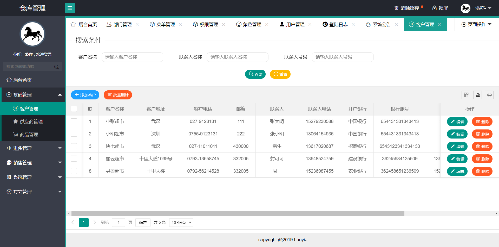

3. 供应商管理：

   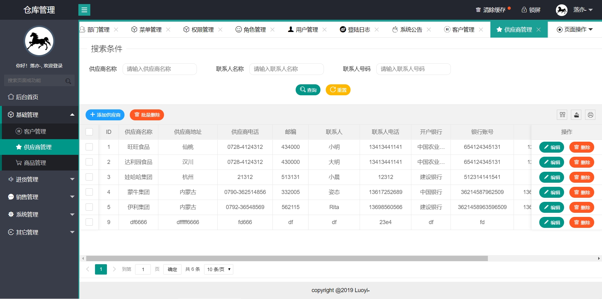

4. 商品管理：

   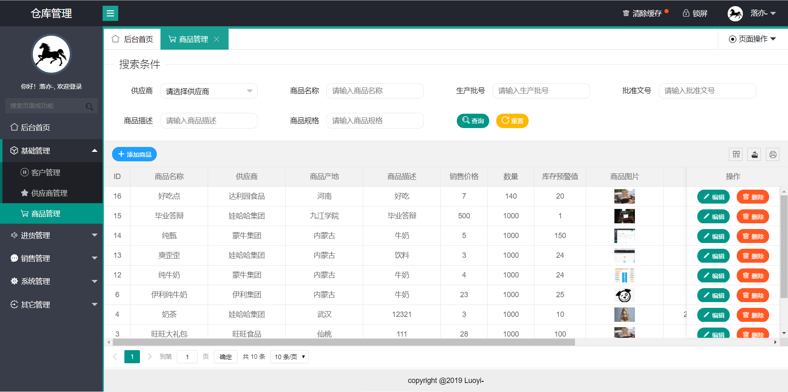

5. 商品进货：

   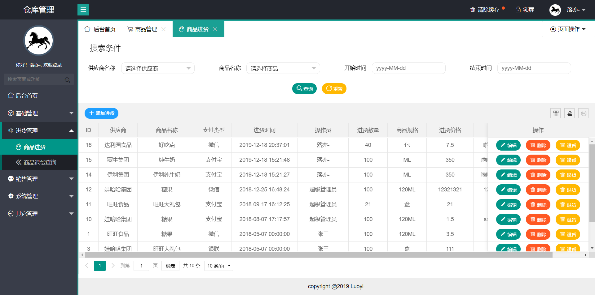

6. 商品退货查询：

   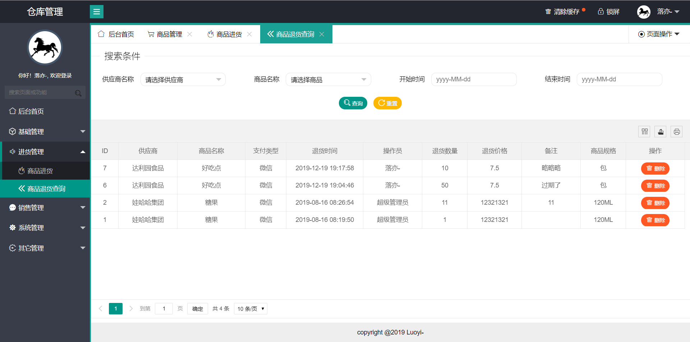

7. 商品销售：

   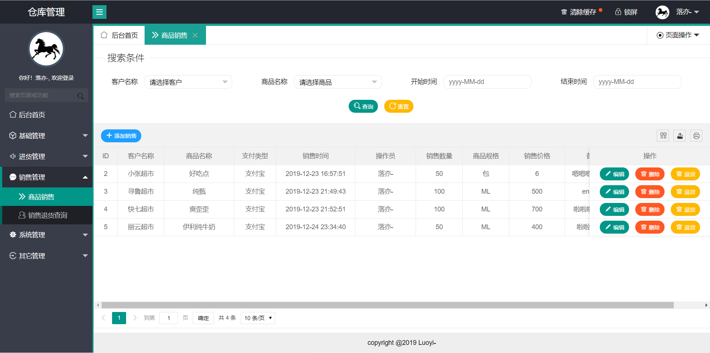

8. 商品退货查询：

   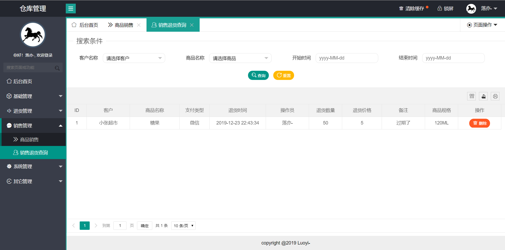

9. 部门管理：

   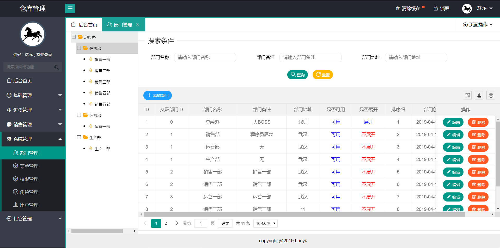

10. 菜单管理：

    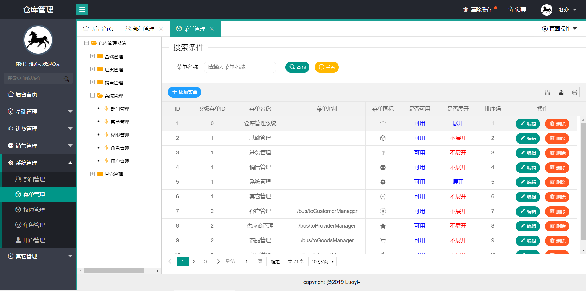

11. 权限管理：

    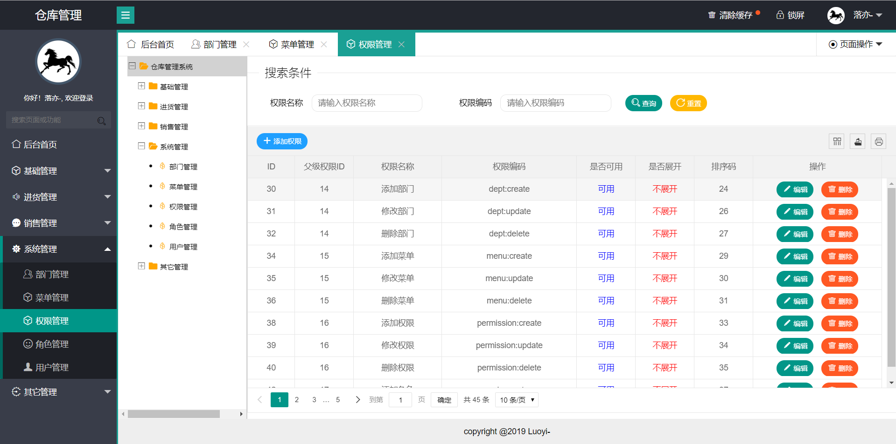

12. 角色管理：

    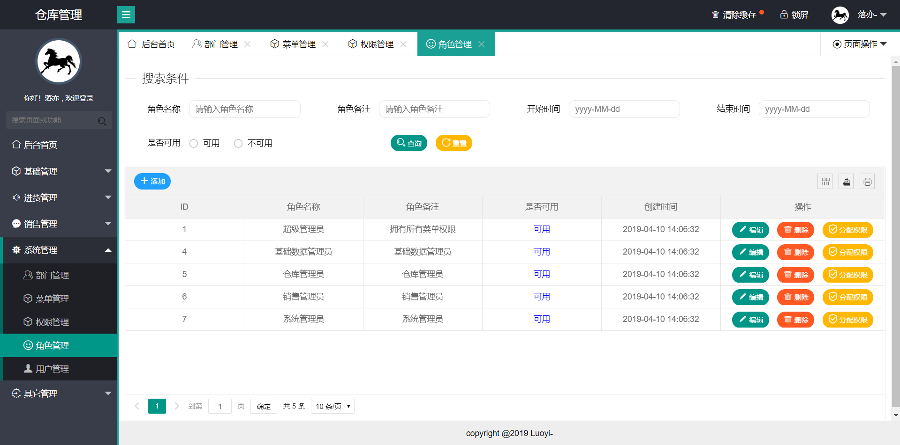

13. 用户管理：

    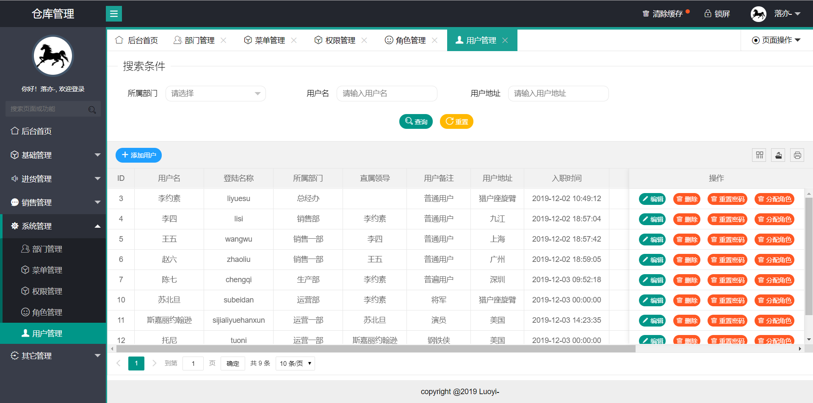

14. 登录日志：

    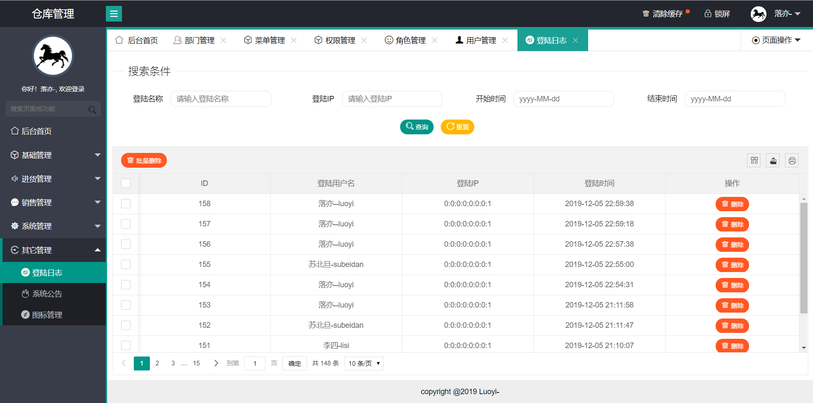

15. 系统公告：

    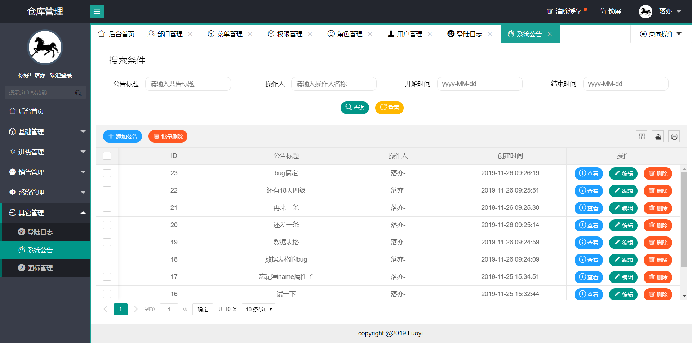

16. 缓存管理：

    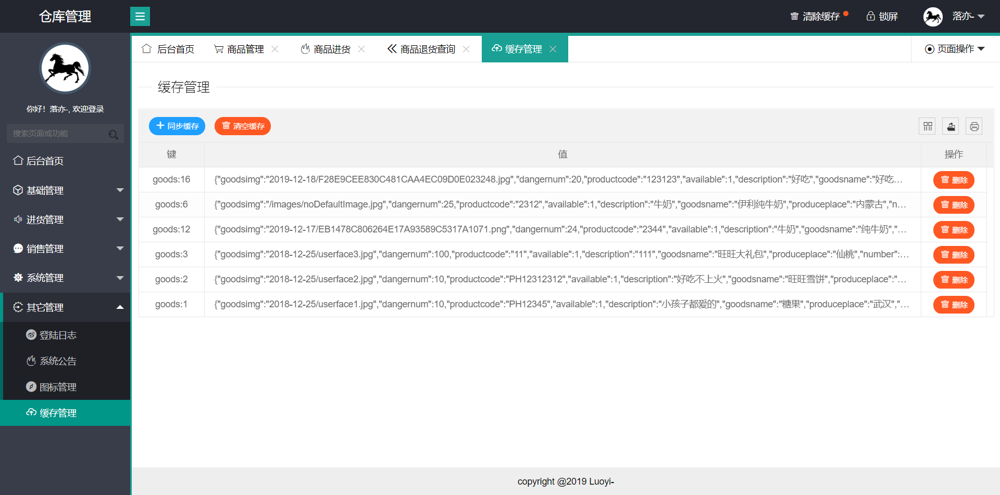

